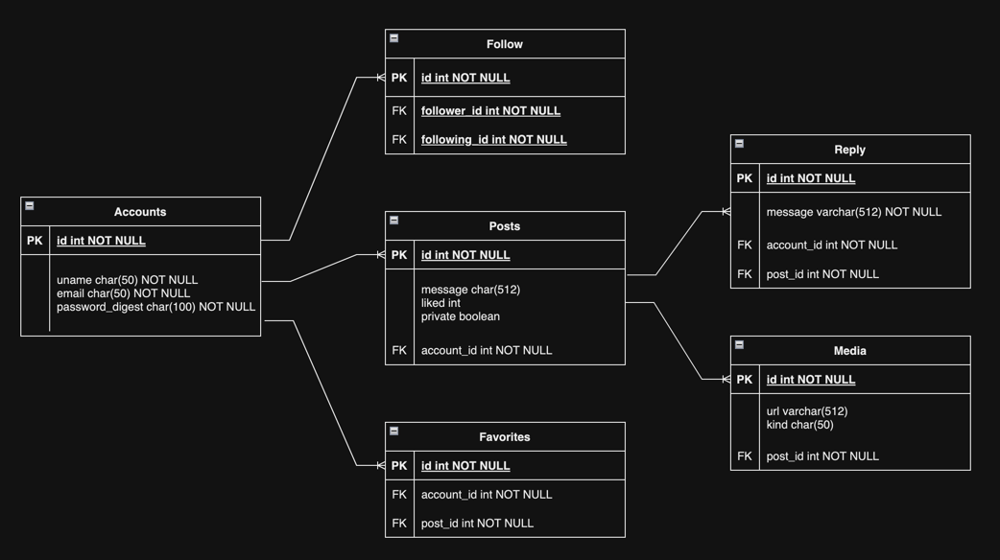

# Shout API

#### Simple image sharing social media. 

The purpose of this project is provide the example to demonstrate the basic features of [Rails](https://guides.rubyonrails.org/api_app.html) framework for building JSON APIs for CRUD operations.

## Data Model:

* Accounts - User account

* Post - Message that a user posted.

* Reply - Message that a user comment on a post.

* Media - Image that a user share along with post.

* Favorite - Post that a user save.

* Follow - Connection between users.

Please see [API Specification](public/openapi.yaml) for more details.

### Setup instruction

1) Clone this repo to your machine.
2) `cd` in to the project folder.
3) Run `bundle install`
4) Run `rake spec` run all tests. (Optional)

### How to start the server
Run `rail server`

### How to start the server with Docker
Run `docker build -t shout . && docker run -e RAILS_ENV=development -p 3000:3000 --name shout_api -d shout:latest`

## Use Postman for testing the API.
1) Open Postman
2) Create a Postman collection by import the specification from `http://localhost:3000/openapi.yaml`